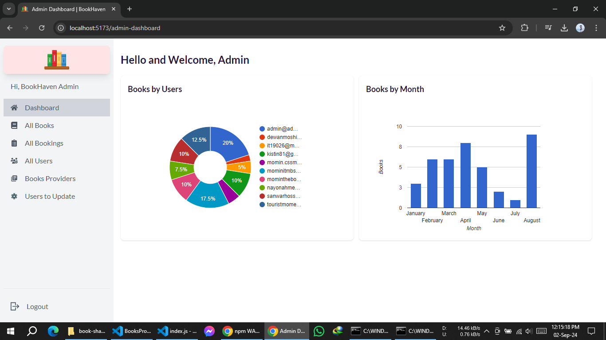

# MBSTU BookHaven (Student Book Sharing Web)

## Live Demo

- [BookHaven on Firebase](https://bookshare-c1817.web.app)
- [BookHaven on Netlify](https://bookhaven1.netlify.app)
- [BookHaven on Surge](https://open-rest.surge.sh)

### Admin Dashboard

*Screenshot of the Admin Dashboard showcasing administrative controls and statistics.*

## Table of Contents

- [Description](#description)
- [Features](#features)
- [Packages Used](#packages-used)

## Description

MBSTU BookHaven is a comprehensive platform for book sharing, enabling users to sign up, add, manage, and book books efficiently. It incorporates various features to ensure a seamless and user-friendly experience.

## Features

1. **User Authentication:**

   - Sign up with name, photo URL, email, and password.
   - Login with email or Google account.
   - Email verification required for new users.
   - User added to the database with their details and role.

2. **Navigation and Accessibility:**

   - Private route protection and redirection, including admin routes.
   - Forgot password option and password reset.
   - Auto-redirection for logged-in users attempting to access the login/register page.

3. **User Interface:**

   - Responsive design for mobile and tablet devices.
   - AOS animations and Lottie Animation for enhanced visuals.
   - Skeleton loaders on the home page and react spinner.

4. **Book Management:**

   - Add, delete, and update books with validation.
   - View all books and search by name or provider.
   - Swipeable book carousel using Swiper React.

5. **User-Specific Features:**

   - User analytics displayed as pie charts.
   - Manage personal book listings and bookings.
   - Profile updates reflected across all user data.
   - Reviews and status updates for booked books.

6. **Admin Capabilities:**

   - Admin dashboard for comprehensive data management.
   - Book and booking deletion capabilities.
   - Ability to upgrade users to admin.
   - Admin routes are protected with JWT and conditions.
   - Admin users can access charts, view user book statistics, and perform various management tasks.

7. **Advanced Functionalities:**

   - JWT for secure authorization.
   - React CountUp and Intersection Observer for dynamic counting.
   - Booking status management and duplicate booking prevention.
   - Provider marks a booking as 'Completed'; other bookings for the same book will be disabled.
   - Implement pagination to integrate seamlessly with search, maintaining accurate page count and limiting results per page.

8. **New Feature: User Admin Panel**
   - Users can now be upgraded to admin.
   - Admins cannot downgrade their own role to 'guest' if they are the only admin left.
   - Admins can delete users but can't delete admin.

## Packages Used

### Dependencies

- [aos](https://www.npmjs.com/package/aos)
- [axios](https://www.npmjs.com/package/axios)
- [firebase](https://www.npmjs.com/package/firebase)
- [flowbite-react](https://www.npmjs.com/package/flowbite-react)
- [lottie-react](https://www.npmjs.com/package/lottie-react)
- [react-countup](https://www.npmjs.com/package/react-countup)
- [react-helmet-async](https://www.npmjs.com/package/react-helmet-async)
- [react-spinners](https://www.davidhu.io/react-spinners)
- [react-hot-toast](https://www.npmjs.com/package/react-hot-toast)
- [react-icons](https://www.npmjs.com/package/react-icons)
- [react-google-charts](https://www.react-google-charts.com/)
- [@tanstack/react-query](https://www.npmjs.com/package/@tanstack/react-query)
- [react-router-dom](https://www.npmjs.com/package/react-router-dom)
- [sweetalert](https://www.npmjs.com/package/sweetalert)
- [swiper](https://www.npmjs.com/package/swiper)

### Dev Dependencies

- [@types/react](https://www.npmjs.com/package/@types/react)
- [@types/react-dom](https://www.npmjs.com/package/@types/react-dom)
- [daisyui](https://daisyui.com/docs/install)
- [tailwindcss](https://tailwindcss.com/docs/guides/vite)
- [vite](https://www.npmjs.com/package/vite)
